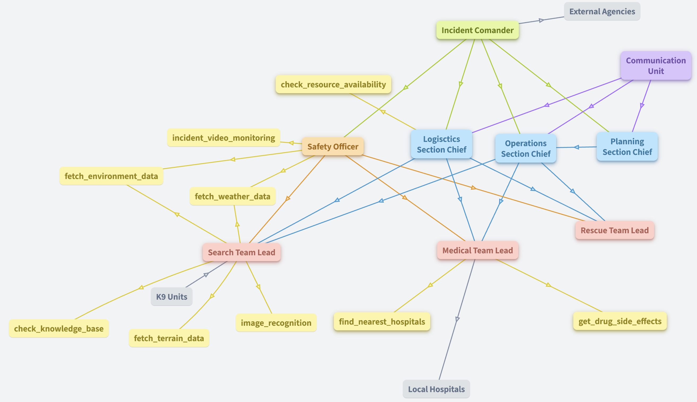

# **Search & Rescue Multi-Agent System with AutoGen Studio**

## **Overview**

This project was developed for **CSC 480: Artificial Intelligence** at **California Polytechnic State University, San Luis Obispo (Cal Poly SLO)**. The goal of this project is to design a high-level **multi-agent system** tailored for **search and rescue operations**.

The system leverages **agentic workflows** using **AutoGen Studio** to emulate the structure and functions of the **Incident Command Search & Rescue System**. Each agent corresponds to a specific role in a real-world search and rescue team, with responsibilities ranging from field operations to logistical support.

Additionally, the project integrates **three specialized skills** for the agents:
- **Medical Team Lead**:
  - `drug_side_effects()` - Analyzes and provides insights into potential side effects of drugs used in the operation.
  - `get_nearest_hospitals()` - Locates and retrieves information on nearby hospitals for emergency care.
- **Search Team Lead**:
  - `fetch_terrain_data()` - Fetches digital elevation models (DEM) to assess the terrain and assist in navigation during search operations.

Below is a diagram illustrating the hierarchy and roles within the system, along with their interdependencies:



---

### **Key Features**
- Implements a multi-agent system for search and rescue operations.
- Models the behavior and hierarchy of the **Incident Command System**.
- Incorporates **agentic workflows** for streamlined role delegation and task management.
- Integrates specific AI-driven skills to enhance operational capabilities:
  - Drug information analysis.
  - Terrain data retrieval.
  - Emergency hospital localization.
```markdown

---

## **Installation**

### Prerequisites
- Anaconda or Miniconda installed

### Steps

1. **Clone the Repository**:  
   Clone the project from GitHub and navigate into the project directory.  
   ```bash
   git clone https://github.com/Belal-Elshenety/Search-Rescue-Multi-Agent-System-with-AutoGen-Studio.git
   cd Search-Rescue-Multi-Agent-System-with-AutoGen-Studio
   ```

2. **Set Up the Environment**:  
   Navigate to the `dependencies` folder and create the Conda environment:  
   ```bash
   cd dependencies
   conda env create -f environment.yml
   ```

3. **Activate the Environment**:  
   Activate the newly created Conda environment:  
   ```bash
   conda activate csc480
   ```

4. **Run AutoGen Studio**:  
   Launch AutoGen Studio locally:  
   ```bash
   autogenstudio ui
   ```

